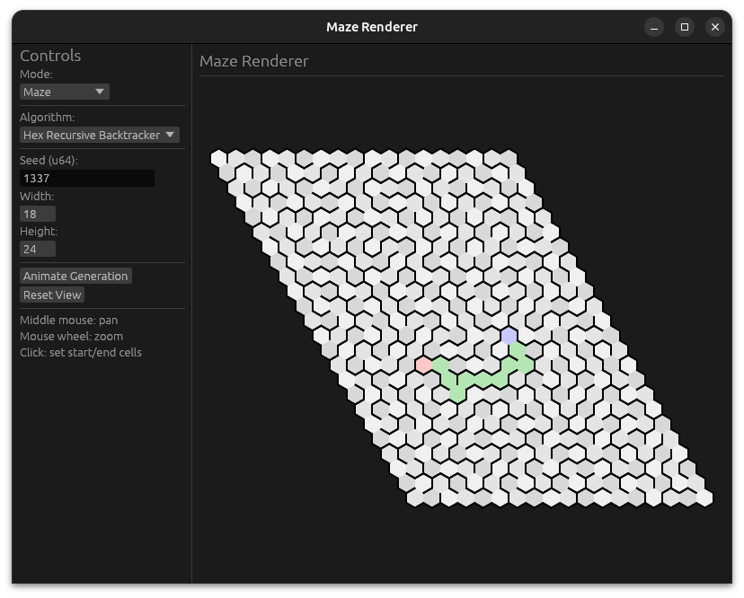
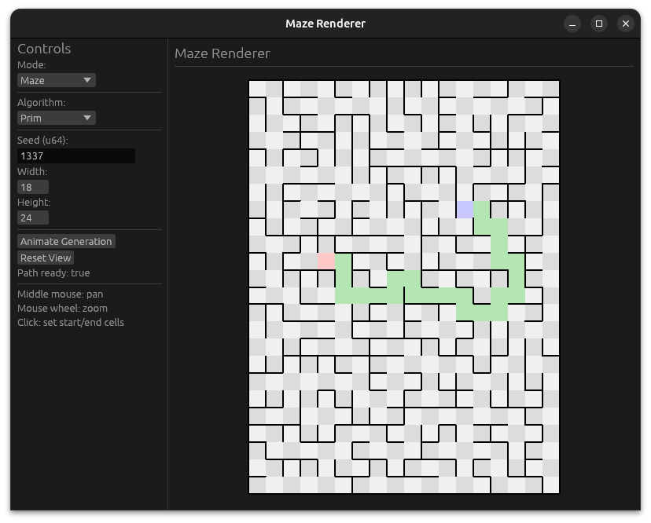
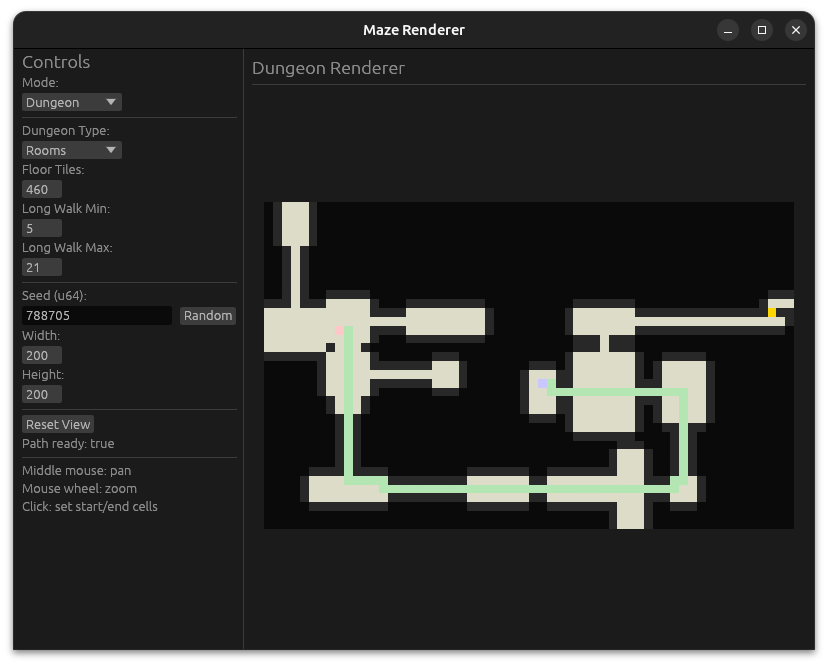

# A maze and dungeon generator

A playground for maze and procedural dungeon generation.

### Maze Mode

| Hex Mazes | Rectangular Mazes |
| --- | --- |
|  |  |

### Dungeon Mode



## Features

- **Maze Generation**: 8 different perfect maze algorithms (recursive backtracker, growing tree, Kruskal, Eller, Wilson, hunt-and-kill, sidewinder, binary tree)
- **Dungeon Generation**: 3 procedural dungeon types (caverns, rooms, winding)
- **Pathfinding**: BFS, DFS, A*, and dead-end filling solvers
- **GUI**: Interactive visualization with pan/zoom, pathfinding overlay, and mode switching
- **CLI**: Command-line generation with ASCII and image output
- **Animation**: Progressive rendering support for both mazes and dungeons

## Example Usage

### GUI

Example GUI usage (default style, seed, and size):

```bash
task example:gui
```

The GUI supports:
- **Mode switching** between maze and dungeon generation
- **Interactive controls** for algorithm/type selection, seed, dimensions
- **Click-to-select** start/end points for pathfinding
- **Pan/zoom** with middle mouse and scroll wheel
- **Live pathfinding** visualization

### CLI - Mazes

Example CLI usage (default style, seed, and size):

```bash
task example:cli
```

Example output:

```text
╷╶───┬╴┌─┬╴┌─┐┌┐
└───┐├┐│╷└─┴╴└┘│
╶─┬┐│╵└┤├┐┌───┐│
┌─┘╵└─┐└┘│└┐┌┐└┤
└─┐┌──┘╶┬┘┌┤╵└─┘
┌┐│└───┐│┌┘│┌──┐
│└┘┌┐┌┐││└┐╵│┌┐│
├──┘└┘└┘└┐└─┘│││
└┐╷┌─┬┐┌┐└┐┌─┘└┤
╷│└┘┌┘└┘│┌┘│┌┐╶┘
│└─┐└─┐╶┘│┌┘││┌┐
├┬┐└─┐│┌─┘└─┘├┘│
│││┌┐│││┌┐╷┌┐│┌┘
││╵│└┘└┴┘└┤││╵└┐
│└┐└┐┌───┐╵│└──┤
└╴└─┴┘╶──┴─┘╶──┘
```

Alternatively, you can generate a PPM image using:

```bash
task example:ppm
```

### CLI - Dungeons

Generate dungeons using the `gen-dungeon` subcommand:

```bash
# Generate a rooms-style dungeon
cargo run --package amaze-cli -- gen-dungeon --type rooms --seed 42 --width 30 --height 20 --floor-count 100

# Generate organic caverns
cargo run --package amaze-cli -- gen-dungeon --type caverns --seed 123 --width 25 --height 15 --floor-count 80

# Generate winding corridors with rooms
cargo run --package amaze-cli -- gen-dungeon --type winding --seed 999 --width 30 --height 20 --floor-count 120 --winding-probability 80
```

Example dungeon output (rooms type):
```text
       ##########
      #..........####
      #..............#
      #..............#
      #..............#
      #..............#
      #..............#
      #..............#
      #.............E#
      #..........####
       ##########
```

Legend:
- `#` = Wall
- `.` = Floor
- `E` = Exit
- ` ` = Empty space
