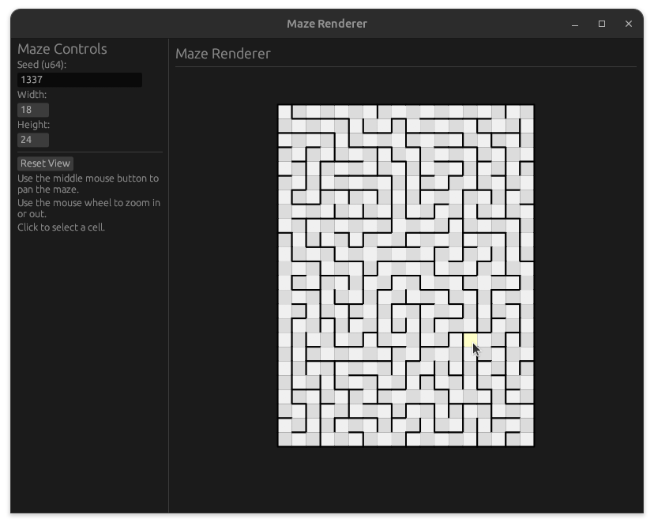

# A maze generator

A playground for maze generation.



## Example Usage

### GUI

Example GUI usage (default style, seed, and size):

```bash
just show-gui
```

This shows the GUI depicted above.

### CLI

Example CLI usage (default style, seed, and size):

```bash
just show-example
```

Example output:

```text
╷╶───┬╴┌─┬╴┌─┐┌┐
└───┐├┐│╷└─┴╴└┘│
╶─┬┐│╵└┤├┐┌───┐│
┌─┘╵└─┐└┘│└┐┌┐└┤
└─┐┌──┘╶┬┘┌┤╵└─┘
┌┐│└───┐│┌┘│┌──┐
│└┘┌┐┌┐││└┐╵│┌┐│
├──┘└┘└┘└┐└─┘│││
└┐╷┌─┬┐┌┐└┐┌─┘└┤
╷│└┘┌┘└┘│┌┘│┌┐╶┘
│└─┐└─┐╶┘│┌┘││┌┐
├┬┐└─┐│┌─┘└─┘├┘│
│││┌┐│││┌┐╷┌┐│┌┘
││╵│└┘└┴┘└┤││╵└┐
│└┐└┐┌───┐╵│└──┤
└╴└─┴┘╶──┴─┘╶──┘
```

Alternatively, you can generate a PPM image using:

```bash
just show-example-ppm
```